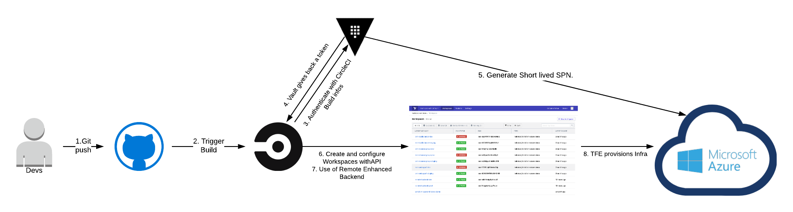
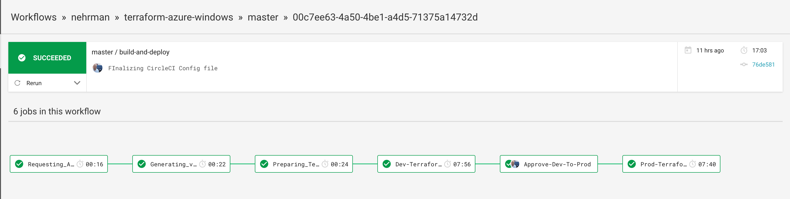
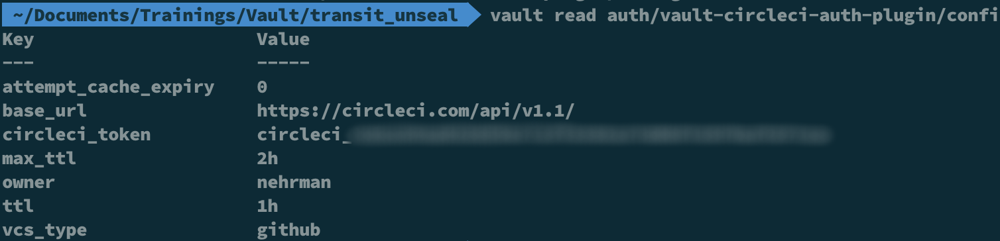
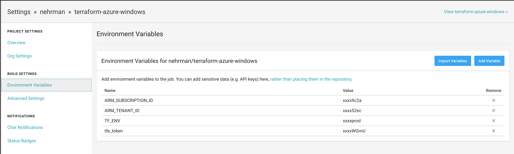

# Terraform-CircleCI-Vault-Demo
This demo illustrates how to migrate from a Terraform OSS workflow to Terraform Enterprise without difficulty. And because I like challenges, I decided to integrate CircleCI with Vault to request Azure dynamic credentials the pipeline is launched.

Here are the technologies and features used in this demo:
- CircleCI Pipeline
- Vault with Custom Plugin for CircleCI Auth
- Azure Dynamic Secrets
- Terraform Enhanced Backend
- Terraform Enterprise APIs



## What does it look like in CircleCI?
Screenshot of the pipeline resulting from the config.yml file:



## How to build the demo?
Here's what you'll need to recreate this demo environment in Azure:

1. **Get an Azure Portal Account** - First you'll need an appropriate **account** in Azure AD to be able to access Azure Portal and to configure Vault Dynamic Secrets.
    - If you don't have an account yet, create a free Azure account here: https://azure.microsoft.com/free/
    - Create a VM on Azure and deploy a Vault instance (OSS or Enterprise) on it using this code: https://github.com/nehrman/vault-circleci-integration
    
    You should end up with something like this:

    

2. **Enable the Azure Secrets Engine** -  Run this command: 
    ```bash
    vault auth enable -path=azure_demo azure
    ```
    Then configure Vault according to our documentation: https://www.vaultproject.io/docs/secrets/azure/index.html

3. **Create a Policy for CircleCI** - Create a policy to authorize your CircleCI project to read creds from Azure Secret Engine:
    ```hcl
    path "azure_demo/creds/my_role" {
      capabilities = ["read"]
    }
    ```
    Attach the policy to your project in the configuration of Vault CircleCI Auth Plugin:
    ```bash
    vault write auth/vault-circleci-auth-plugin/map/projects/project_name value=policy_name
    ```

4. **Sign up for a Terraform Cloud Trial** - Next we'll need a Terraform Cloud trial account.
    - Sign up here: https://www.hashicorp.com/go/terraform-enterprise-trial
    - Log onto your new account here: https://app.terraform.io
    - Follow the [guide](https://www.terraform.io/docs/enterprise/getting-started/index.html) to:
        - Create an `organization` 
        - Create a `token`
5. **Configure CircleCI** - If you don't already have an account, sign up [here](https://circleci.com/signup)
    *To make things easier, create an account with your Github Account* :)
    Now, follow these steps :
    - Click on `+ Add Project`:  
    
    - Select your project and click on `Set Up Project`:  
    
    - Finally, configure the environment variables in your project:  
    

*Bravo!!!!*, you're all set and ready to test the pipeline. 

## Special thanks
* **Marc Boudreau** - For his amazing work creating vault CircleCI Auth plugin [Github](https://github.com/marcboudreau)
* **Joern Stenkamp** - For helping me figure out the TFE variables creation [Github](https://github.com/joestack)

## Authors
* **Nicolas Ehrman** - *Initial work* - [Hashicorp](https://www.hashicorp.com)
